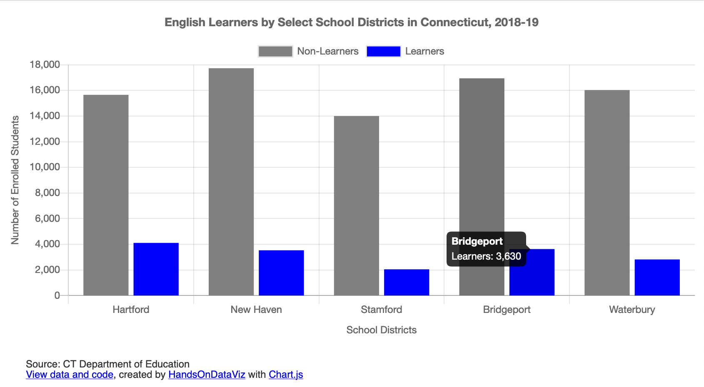

# Bar or Column Chart with One or More Data Series in Chartjs



## Demo 
https://handsondataviz.github.io/chartjs-bar/

Sample data by CT Department of Education.

## Create your own
See chapter 10: Chart.js and Highcharts templates in [Hands-On Data Visualization](https://handsondataviz.org) by Jack Dougherty and Ilya Ilyankou

Prepare your data in CSV format and upload into a `data.csv` file. Place labels that will appear along the axis in the first column, and each data series in its own column. Your CSV must contain at least two columns (labels and one data series). You can add as many data series columns as you wish. 

| district  | nonlearner | learner |
|-----------|------------|---------|
| Hartford  | 15656      | 4111    |
| New Haven | 17730      | 3534    |

In `script.js`, customize the values of variables shown in the code snippet below:

```javascript
  var HORIZONTAL = false;   // `false` for vertical column chart, `true` for horizontal bar chart
  var STACKED = false;  // `false` for individual bars, `true` for stacked bars

  var TITLE = 'English Learners by Select School Districts in Connecticut, 2018-19';

  var LABELS = 'district';  // Column to define 'bucket' names on x-axis (for vertical column chart) or y-axis (for horizontal bar chart)

  var SERIES = [  // For each column representing a data series, define its name and color
    {
      column: 'nonlearner',
      name: 'Non-Learners',
      color: 'grey'
    },
    {
      column: 'learner',
      name: 'Learners',
      color: 'blue'
    }
  ];

  var X_AXIS = 'School Districts';  // x-axis label and label in tooltip
  var Y_AXIS = 'Number of Enrolled Students'; // y-axis label and label in tooltip

  var SHOW_GRID = true; // `true` to show the grid, `false` to hide
  var SHOW_LEGEND = true; // `true` to show the legend, `false` to hide
```

For more customization, see [Chart.js documentation](https://www.chartjs.org/docs/latest/).

## Why am I not seeing my chart when I open `index.html` in the browser?
This error is known as cross-origin request error. When you double-click the file to open locally in your browser, you will see the URL in the address bar starting with `file:`, and all attempts to read a local CSV file, even though it is located in the same folder, will fail.

Here are a few ideas how to go around it:
* Find out how to disable same-origin policy in your browser (to start with, see [this Stackoverflow thread](https://stackoverflow.com/questions/3102819/disable-same-origin-policy-in-chrome)).
* Install a program that will emulate a local server on your device, such as `live-server`(https://www.npmjs.com/package/live-server).
* Move your CSV files to a remote location on the web (such as GitHub Gist, AWS S3, or a Wordpress site),
and in `script.js`, change `d3.csv('data.csv')` to `d3.csv('https://wherever.your/file/is/data.csv')`.
* Do all the development (file modifications) within GitHub without downloading this repository, using either GitHub's web interface, or GitHub Desktop application.

## See other chart templates
* Chart.js Bar Chart with Error Bars: https://github.com/HandsOnDataViz/chartjs-error-bars
* Chart.js Line Chart: https://github.com/HandsOnDataViz/chartjs-line
* Chart.js Scatter Chart: https://github.com/HandsOnDataViz/chartjs-scatter
* Chart.js Bubble Chart: https://github.com/HandsOnDataViz/chartjs-bubble
* Highcharts Annotated Line Chart: https://github.com/HandsOnDataViz/highcharts-line-annotated